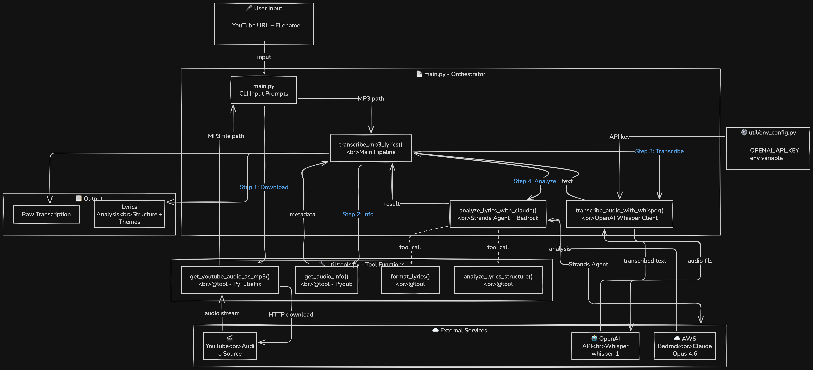

# YouTube Lyrics AI Workflow 🎵

Transcribe and analyze song lyrics from YouTube videos using OpenAI Whisper and AWS Bedrock Claude models.

## Overview

This project automatically downloads audio from YouTube videos, transcribes lyrics using OpenAI's Whisper API, and provides detailed analysis using AWS Bedrock's Claude Opus model. The system processes the entire audio file in one pass and provides formatted lyrics with structural analysis.

## Important Links

- [Strands SDK](https://github.com/strands-ai/strands) - AI agent framework
- [OpenAI Whisper](https://openai.com/research/whisper) - Audio transcription
- [AWS Bedrock](https://aws.amazon.com/bedrock/) - Claude AI models
- [PyTubeFix](https://github.com/JuanBindez/pytubefix) - YouTube audio download
- [Pydub](https://github.com/jiaaro/pydub) - Audio processing

## Architecture




## Demo


## Pre-requisites

You need the following env variables, you can save them as `.env` files in your project

```bash
# aws bedrock access
AWS_REGION="<bedrock-region>"
AWS_ACCESS_KEY_ID="<aws-session-key-id>"
AWS_SECRET_ACCESS_KEY="<aws-session-access-key>"
AWS_PROFILE="<login-profile-check-credentials-or-enter-default>"
# open ai api access
OPENAI_API_KEY="<openai-api-key>"
```

## Features

- ✅ **YouTube Audio Download** - Automatically download audio from any YouTube video using PyTubeFix
- ✅ **Whisper Transcription** - High-accuracy transcription using OpenAI Whisper API
- ✅ **Claude Analysis** - Deep lyrics analysis using AWS Bedrock Claude Opus 4.6
- ✅ **Structure Analysis** - Automatically identify verses, choruses, bridges, and song patterns
- ✅ **Formatted Output** - Get properly formatted lyrics with line breaks
- ✅ **Audio Metadata** - Extract duration, bitrate, and other audio information
- ✅ **Instrumental Detection** - Identifies sections with music only (no vocals)

## Architecture

**Two-Step Process:**

1. **Transcription (OpenAI Whisper)** - Converts audio to text
   - Processes entire audio file in one API call
   - Handles up to 25MB audio files
   - Returns '♪♪♪' for instrumental sections
   - Provides language detection and timestamps

2. **Analysis (AWS Bedrock Claude)** - Analyzes transcribed lyrics
   - Formats lyrics with proper structure
   - Identifies song components (verse, chorus, bridge)
   - Analyzes themes, patterns, and meaning
   - Provides insights about the song's message

## Requirements

- Python 3.14+
- FFmpeg (for audio processing)
- AWS CLI configured with appropriate credentials
- OpenAI API key
- AWS account with Bedrock access


### Mostly Instrumental Detection

If you see mostly `♪` symbols:
- The audio may be primarily instrumental
- Vocals may be too quiet in the mix
- Try boosting vocal frequencies before transcription

## API Costs

### OpenAI Whisper Pricing
- $0.006 per minute of audio
- Example: 4-minute song = $0.024

### AWS Bedrock Claude Pricing (approximate)
- Input: ~$0.015 per 1K tokens
- Output: ~$0.075 per 1K tokens
- Typical analysis: $0.05 - $0.20 per song


## Pricing
Below is the pricing page for openai and bedrock

- [OpenAI Pricing](https://openai.com/pricing)
- [AWS Bedrock Pricing](https://aws.amazon.com/bedrock/pricing/) for current rates.

## Limitations

- **Audio Size:** Whisper API has 25MB file size limit
- **Audio Length:** Long files (>30min) may require compression
- **Quality Dependency:** Transcription quality depends on:
  - Vocal clarity
  - Background noise levels
  - Audio mixing quality
- **Language Support:** Best for English, varies for other languages
- **Instrumental Music:** Limited transcription for instrumental sections
- **YouTube Restrictions:** Some videos may not be downloadable

## Dependencies

Key dependencies (see `pyproject.toml` for complete list):

- `strands-agents` - AI agent framework (also supports Bedrock)
- `openai` - OpenAI API client (Whisper)
- `pytubefix` - YouTube audio download library
- `pydub` - Audio processing library
- `python-dotenv` - Environment variable management
- `audioop-lts` - Peer dependency for the `pydub` module, used for Audio operations

## Contributing

Contributions are welcome! Areas for improvement:

- [ ] Add support for longer audio files (chunking)
- [ ] Support for more languages
- [ ] Batch processing multiple URLs
- [ ] Web interface
- [ ] Export to different formats (JSON, SRT, etc.)
- [ ] Support for other AI providers

---

**Made with ❤️ for music transcription and analysis**
